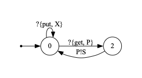

# erlang-caa-kit

## Overview

This project contains a number of prototype tools for working with the Communicating Actor Automata model of Erlang programs as described
in the paper [Communicating Actor Automata -- Modelling Erlang Processes as Communicating Machines](https://arxiv.org/abs/2304.06395) by Orchard, Munteanu,
and Torrens.

The aim of this work is to provide a starting point for future tools
that could be used to leverage the CAA model for formal program development
of Erlang code.

## Status and Contributing

This code is experimental, and largely not in active development as of 2023.

We would gratefully accept contributions.
If you would like to contribute, please get in touch, or fork and make a PR.

A good starting projet would be to produce a command line interface for
this tool, packaging it so it is more easily deployed.

## Requirements and Environment

The code requires Erlang/OTP and has been tested with OTP25.

If you would like to generate visualisations then GraphViz is recommended,
although it is not necessary to generate models and generate code from
models.

## Using erlang-caa-kit

At the moment, `erlang-caa-kit` is driven from the `eshell` (Erlang Shell) via the command line, with two main components exemplified below.

### Model generation and visualisation

Start in the Erlang shell `erl`, then compile the relevant modules:

```
c(type).
c(method_Form).
c(generate_visualisation).
c(generate_model).
```

The core functionality is then via the
 `main` method which takes three inputs: the name of the file to
analyse, the name of function to analyse (including its arity
in Erlang's style of `functionName/arity`), and lastly a string prefix to give
to filenames for the visualisations generated along with the model.

For example, consider the `e` function in `testing_files/examples.erl`, which
has the code:

```
e(S) ->
    receive
        {get, P} -> P!S, e(S);
        {put, X} -> e(X)
end.
```

We can generate a model from this code by running:

```
generate_model:main("testing_files/examples.erl", "e/1", "example").
```

This performs static analysis of the following code
outputting the Erlang representation of the CAA model:

```
{0,
 [{0,{recv,[{tuple,7,[{atom,7,get},{var,7,'P'}]}]},2},
  {2,{send,{var,7,'P'},{var,7,'S'}},0},
  {0,{recv,[{tuple,8,[{atom,8,put},{var,8,'X'}]}]},0}]}
```

This also generates three files:
- `exampleautomata.txt` - The above Erlang representation saved in text format;
- `examplegraph.dot` - The DOT file for the automata;
- `exampleCAA.pdf` - A PDF rendering of the DOT file (assuming GraphViz is installed).

For example, `exampleCAA.pdf` here give us the visualisation of this
function's CAA model:




### Code generation


## Help or Discussion

If you would like to discuss, please contact Dominic (d DOT a DOR orchard AT kent DOT ac DOT uk).

## Authors and Acknowledgement

- Mihail Munteanu (@Qemikal)
- Kartik Jalal (@Kartik-jalal)
- Dominic Orchard (@dorchard)
